# Hardware Description Languages

This course is intended to teach two of the main HDL’s used in academic environments and in the industry: verilog and VHDL.

## Practice 01

 

## Simulation

 

## Hw 01

 

## Simulation

 

## Hw 02

 

## Simulation

 

## Practice 02 A (Generalized AdderRipleCarry)

 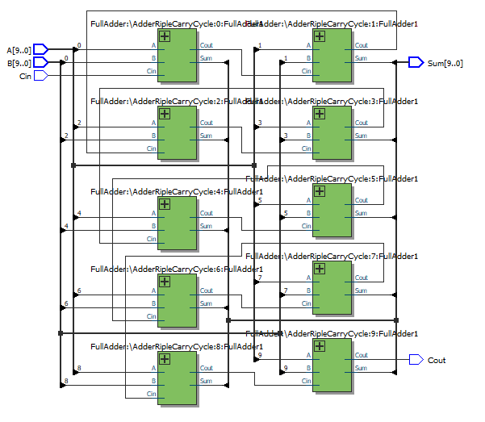

 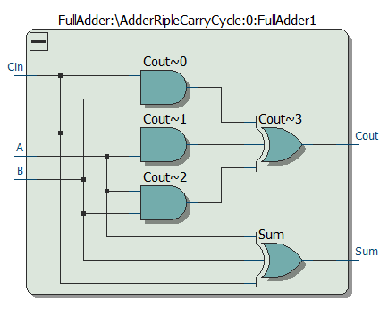

## Simulation

A,B,Cin and Sum

## A = [0-15] B = [0-15] Cin = 1

 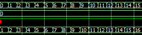

 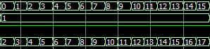

 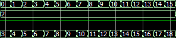

 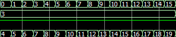

 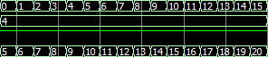

 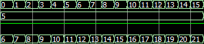

 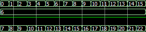

 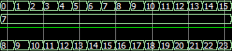

 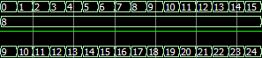

 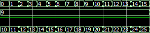

 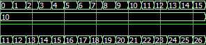

 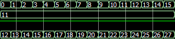

 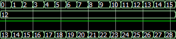

 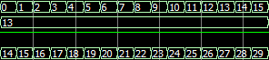

 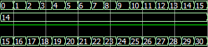

 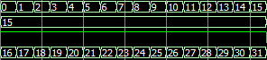

## A = [0-15] B = [0-15] Cin = 1

 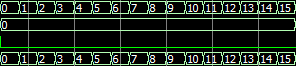

 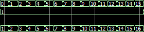

 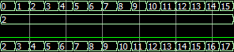

 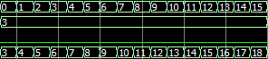

 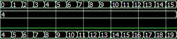

 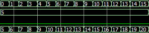

 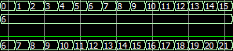

 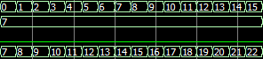

 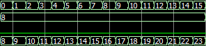

 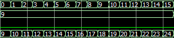

 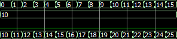

 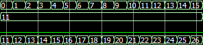

 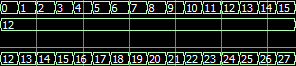

 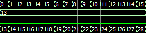

 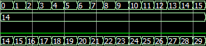

 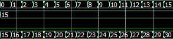

